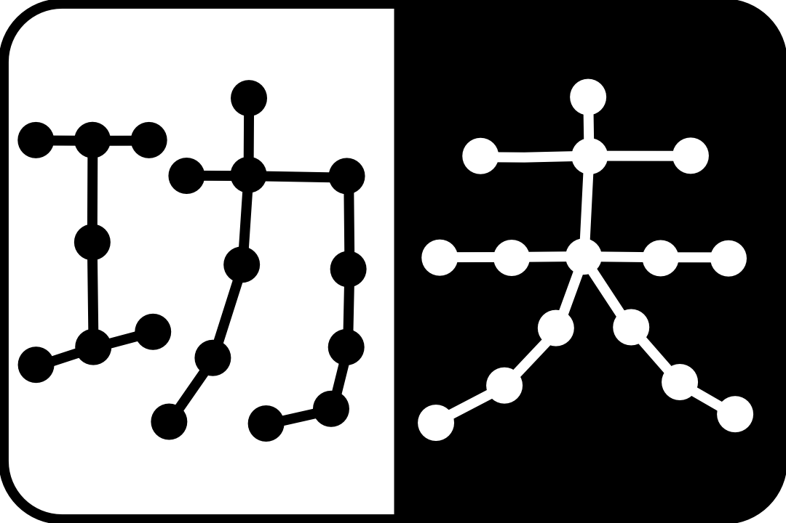
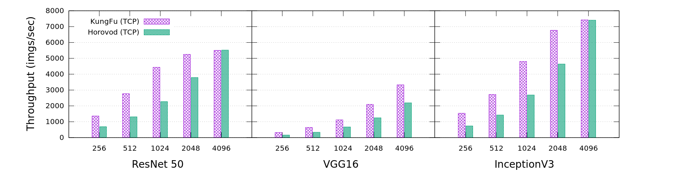
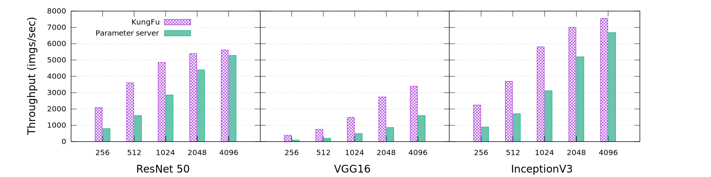

<div align="center">
    
</div>

# KungFu

Making adaptive distributed machine learning easy and efficient.

[](https://travis-ci.com/lsds/KungFu)
[](https://kungfu.readthedocs.io/en/latest/?badge=latest)

## Features

KungFu aims to help users achieve *fast* and *adaptive* distributed machine learning with *minimal* efforts. This is important because a machine learning system must cope with growing complex models and increasingly complicated deployment environments, making it
difficult to constantly deliver high performance with an *empirical* configuration.
To address this, KungFu provides the following unique features:

* Simplicity: KungFu permits distributed training by adding minimal code in your training program. KungFu is also simple to install and run. It does not require extra deployment like parameter servers and heavy dependencies like MPI in Horovod.
* Adaptable distributed training: KungFu provides useful advanced [distributed optimizers](srcs/python/kungfu/tensorflow/optimizers/__init__.py) such as
communication-efficient ``PairAveragingOptimizer`` and hyper-parameter-robust ``SynchronousAveragingOptimizer`` to help you address the cases in which conventional Synchronous SGD does not scale. See [Optimizers](https://github.com/lsds/KungFu#choosing-the-right-optimizer) for how to choose the right KungFu optimizer for your training scenario.
* Online monitoring and control: KungFu aims to support [distributed SGD metrics](srcs/python/kungfu/tensorflow/optimizers/sync_sgd.py) such as [gradient noise scale](https://openai.com/blog/science-of-ai/) to help understand the training process with low overhead.
KungFu further provides control operators such as ``barrier`` and ``resize_cluster`` to help reconfigure training online, even in response to monitored metrics.
* Fast and scalable: KungFu has a decentralized architecture, an non-blocking runtime, and high-performance implementations of communication, monitoring and control operators. Check out its performance in [Benchmark](https://github.com/lsds/KungFu#benchmark).

We have been using KungFu for scaling out different deep learning models such as ResNet, DenseNet, OpenPose, BERT, CycleGAN and Alpha Zero. Check out their [examples](https://github.com/lsds/KungFu#examples).

## Usage

KungFu currently support TensorFlow and Keras. To scale out your TensorFlow program, for example, you need to make two changes:

1. Wrap your ``tf.train.optimizer`` in KungFu's ``SynchronousSGDOptimizer``, ``SynchronousAveragingOptimizer``, or ``PairAveragingOptimizer``.

2. Ensure all workers start with consistent states by broadcasting a worker's initial global variables.

```python
import tensorflow as tf

# Build model...
loss = ...
opt = tf.train.AdamOptimizer(0.01)

# KungFu Step 1: Wrap tf.optimizer in KungFu optimizers
from kungfu.tensorflow.optimizers import SynchronousSGDOptimizer
opt = SynchronousSGDOptimizer(opt)

# Make training operation
train_op = opt.minimize(loss)

# Train your model
with tf.Session() as sess:
    sess.run(tf.global_variables_initializer())

    # KungFu Step 2: ensure distributed workers start with consistent states
    from kungfu.tensorflow.initializer import BroadcastGlobalVariablesOp
    sess.run(BroadcastGlobalVariablesOp())

    for step in range(10):
        sess.run(train_op)
```

You can find more details in the [Documentation](https://kungfu.readthedocs.io/en/latest/?badge=latest), for example, for how to use KungFu with [Session](examples/tf1_mnist_session.py), [TensorFlow Keras](examples/tf1_mnist_keras.py), [Estimator](examples/tf1_mnist_estimator.py), and [GradientTape](examples/tf2_mnist_gradient_tape.py) in TensorFlow 1 and 2.
For KungFu with Keras, check out [here](examples/keras_mnist.py).

## Install

KungFu is implemented in Go and C++.
Currently, it has a Python binding for TensorFlow (including v1 and v2) and Keras (assuming you use TensorFlow as the backend).

KungFu for TensorFlow requires [Python 3](https://www.python.org/downloads/), [CMake 3.5+](https://cmake.org/install/), and [Golang 1.13+](https://golang.org/dl/).
KungFu has been tested with [TensorFlow](https://www.tensorflow.org/install/pip#older-versions-of-tensorflow) 1.12, 1.13, 1.15 and 2.0.0.
KungFu has a known installation issue with TensorFlow 1.14.
Assuming you have the above pre-requites, you can install KungFu as follows:

```bash
git clone https://github.com/lsds/KungFu.git
cd KungFu
pip3 install --no-index -U --user .
```

<!-- If you get `permission denied errors`, try install `kungfu-run` separately
```bash
# or download golang during install if golang is missing
# KUNGFU_DOWNLOAD_GO=1 pip3 install --no-index -U --user .

KUNGFU_BUILD_TOOLS=OFF pip3 install --no-index -U --user . # disable install kungfu-run with pip
GOBIN=<PATH> go install -v ./srcs/go/cmd/kungfu-run # install kungfu-run to <PATH>
``` -->

KungFu provides ``kungfu-run`` to launch a KungFu process on a multi-GPU server.
In a cluster, we need to launch ``kungfu-run`` on each node.

```bash
# Show the help of kungfu-run
kungfu-run -help
```

You can use KungFu with Docker. Check out the docker files for [GPU](docker/Dockerfile.tf-gpu) and [CPU](docker/Dockerfile.tf-cpu) machines.

## Run

We show how to run a KungFu program using a MNIST example.
Download the MNIST dataset ([script](scripts/download-mnist.sh)) first and then run the following training script:

```bash
# Train a Single Layer Perception (SLP) model for the MNIST dataset using 4 CPUs for 10 data epochs.
kungfu-run -np 4 python3 examples/tf1_mnist_session.py --data-dir=./mnist
```

You can run this example on two machines (assuming each with 8 GPUs) using the below command (NOTE: this command must be called on each machine):

```bash
# Assume the machines have NIC eth0 and their IPs are 192.168.0.1 and 192.168.0.2.
# Assume NUM_GPU_SLOTS=8, NUM_GPUS=16
kungfu-run -np $NUM_GPUS \
    -H 192.168.0.1:$NUM_GPU_SLOTS,192.168.0.2:$NUM_GPU_SLOTS -nic eth0 \
    python3 examples/tf1_mnist_session.py  --data-dir=./mnist
```

``kungfu-run`` use the ``nic`` option to infer its IP and thus its role in the cluster.

## Examples

We have been using KungFu in training
different kinds of AI models.
The following are representative examples:

* ***ImageNet***: KungFu can speed up the training
of ResNet, VGG, DenseNet and others for ImageNet.
Check out this in an [ImageNet benchmark suite](https://github.com/luomai/benchmarks/tree/cnn_tf_v1.12_compatible_kungfu/scripts/tf_cnn_benchmarks#running-kungfu) extended from the [TensorFlow benchmark](https://github.com/luomai/benchmarks/tree/cnn_tf_v1.12_compatible_kungfu).

* ***Pose estimation***: Pose estimation models such as [OpenPose](https://github.com/CMU-Perceptual-Computing-Lab/openpose) are often batch-size sensitive.
We used KungFu in
a popular [OpenPose implementation](https://github.com/tensorlayer/openpose-plus) and improved time-to-accuracy
using the model averaging optimizer which preserves the merits of small batch size.

* ***Natural language processing***:
We have an [example](https://github.com/luomai/bert) that shows how you can use few lines to enable distributed training for the Google BERT model.

* ***Adversarial learning***:
Adversarial learning trains multiple networks in parallel and prefer using small batches for training.
KungFu thus become an attractive option, because of its minimal changes to GAN programs
and its optimizers that decouple batch size and system parallelism.
See the [CycleGAN example](https://github.com/tensorlayer/cyclegan).

* ***Reinforcement learning***:
We are working on an Alpha Zero distributed training example and will release it soon.

## Choosing the right optimizer

KungFu aims to help users decrease the
time to reach a desired accuracy (time-to-accuracy)
through scaling.
There are two major ways to improve time-to-accuracy in KungFu:

* Synchronous SGD: Adopt parallel workers to improve the estimation of gradients, and
reach a minima quickly using an increased learning rate.
* Model Averaging: Adopt parallel workers to explore the solution space and collaborate through averaging diverged models in order
to find a good minima quickly.

***Synchronous SGD***:
Synchronous SGD (S-SGD) is implemented as ``SynchronousSGDOptimizer`` in KungFu, equivalent to
the DistributedOptimizer in Horovod.
The use of S-SGD, however, poses scalability and accuracy challenges.
Scalability-wise, all S-SGD workers must exchange all gradients per iteration, making
them hard to deal with limited bandwidth and stragglers;
(ii) accuracy-wise, S-SGD *couples* training batch size with the number of workers,
enforcing users to use large batch sizes, which can adversely
affect the generality of a trained model (see [paper](https://arxiv.org/abs/1609.04836)).
To compensate the loss in generality, users must explore various [methods](https://research.fb.com/wp-content/uploads/2017/06/imagenet1kin1h5.pdf)
for tuning hyper-parameters.

***Model averaging***:
Model averaging is implemented as ``SynchronousAveragingOptimizer`` and
``PairAveragingOptimizer`` in KungFu.
The former realizes the hyper-parameter-robust [SMA](http://www.vldb.org/pvldb/vol12/p1399-koliousis.pdf)
algorithm; while the latter implements the [AD-PSGD](https://arxiv.org/abs/1710.06952) algorithm
which reduces bandwidth consumption and tolerates stragglers.
In model averaging, each worker trains its local
model using SGD, and average
its model with peers to speed up the search for minima.
Model averaging algorithms have a convergence guarantee (see [EA-SGD paper](https://arxiv.org/abs/1412.6651))
and can converge fast with DL models (see [Lookahead paper](https://arxiv.org/abs/1907.08610)).
A useful property of model averaging is: it decouples
batch size with system parallelism, often making
it *hyper-parameter robust*. We find
this property valuable
as DL users often find it hard and expensive to
tune synchronous SGD at scale.

***Convergence evaluation***:
We have tested KungFu optimizers using ResNet-50 and ResNet-101 for ImageNet.
When using 8 V100, all KungFu optimizers can reach the target 75% accuracy,
the same as the baseline Horovod.
When using 16 V100, Horovod and ``SynchronousSGDOptimizer`` suffer from
the increased batch size and their accuracy drop to 59% while
``SynchronousAveragingOptimizer`` and ``PairAveragingOptimizer`` still
reach the target 75%.
All these tests use a per-GPU batch size as 64 and [hyper-parameters](https://github.com/tensorflow/benchmarks/tree/master/scripts/tf_cnn_benchmarks#getting-started)
suggested by the TensorFlow benchmark authors.

## Benchmark

We benchmark KungFu in a cluster that has 16 V100 GPUs hosted by 2 DGX-1 machines.
The machines are interconnected by a 100 Gbps network. We measure the training throughput of ResNet-50, VGG16 and InceptionV3. These models represent different kinds of training workloads.

In the ***synchronous training*** case, we compare KungFu (``SynchronousSGDOptimizer``) with [Horovod](https://github.com/horovod/horovod) (0.16.1). Horovod uses OpenMPI 4.0.0. We evaluate the spectrum of batch size (from 256 to 4096) commonly used by S-SGD users.
This batch size is evenly shared by the 16 GPUs.
KungFu outperforms Horovod on all tested models, in particular with small batch sizes which significantly raise the
frequency of synchronization.



In the ***asynchronous training*** case, we compare KungFu (``PairAveragingOptimizer``) with TensorFlow parameter servers (1.13.1). We uses the same range of batch sizes as above. KungFu exhibits better scalability as well.



We have also run the same benchmark in a 16-server cluster (each has a P100).
KungFu exhibits better scalability in this communication-challenging environment,
and we thus only report the 16 V100 result here. You can find the benchmark scripts [here](benchmarks/system/).

## Development

KungFu is designed with extensibility in mind.
It has a low-level API and a modular architecture, making
it suitable for implementing new distributed training algorithms.
Check out the developer [guideline](CONTRIBUTING.md) for more information.
