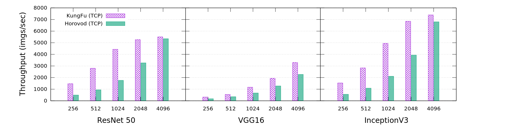
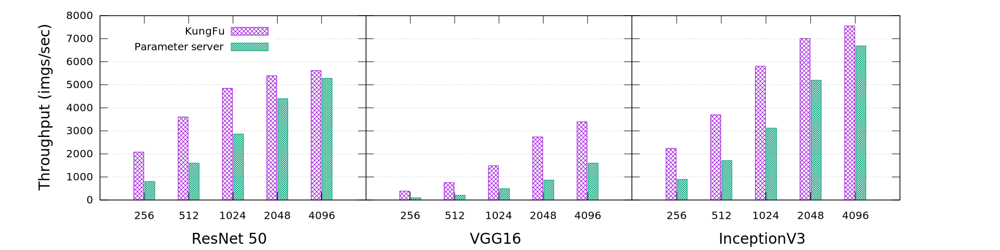

# KungFu

Adaptive, fast and easy machine learning at scale.

## Features

KungFu enables users to achieve
fast and adaptive machine learning.
This is important as machine learning systems are being
exposed to growing complex models and increasingly complicated deployment environments.
KungFu has the following unique features:

* Simplicity: KungFu allows you to enable distributed training by adding only one line of code.
* Adaptive synchronisation: KungFu provides many advanced [synchronisation algorithms](srcs/python/kungfu/optimizers/__init__.py) such as
[AD-PSGD](https://arxiv.org/abs/1710.06952) and [SMA](http://www.vldb.org/pvldb/vol12/p1399-koliousis.pdf) to help you address the cases where [Synchronous SGD](https://papers.nips.cc/paper/4687-large-scale-distributed-deep-networks.pdf) is not effective.
* Monitoring: KungFu provides useful training metrics such as ``gradient variance`` and [gradient noise scale](https://openai.com/blog/science-of-ai/) to help you understand your training with negligble overheads.
* Control: KungFu provides online control operators such as ``barrier`` and ``resize`` to seamlessly control your training system.
* Extensibility: KungFu has a clean low-level API that allows you easily implement new synchronisation, monitoring and control algorithms.

You can check the performance of KungFu in the Benchmark section below.

## Usage

To use KungFu, make the following additions to your program. This example uses TensorFlow.

1. Wrap optimizer in ``kungfu.optimizers.SyncSGDOptimizer`` or other [distributed optimizers](srcs/python/kungfu/optimizers/__init__.py).

2. Run ``opt.distributed_initializer()`` after you call ``tf.global_variables_initializer()``.
    The distributed initializer synchronises initial variables on all workers.

```python
import tensorflow as tf

# Build model...
loss = ...

# You may want to scale the learning rate
from kungfu.ops import current_cluster_size
opt = tf.train.AdagradOptimizer(0.01 * current_cluster_size())

# Add KungFu Distributed Optimizer
from kungfu.optimizers import SyncSGDOptimizer
opt = SyncSGDOptimizer(opt)

# Make training operation
train_op = opt.minimize(loss)

with tf.Session() as sess:
    sess.run(tf.global_variables_initializer())
    sess.run(opt.distributed_initializer()) # KungFu

    # Train your model for 10 steps.
    for step in range(10):
        sess.run(train_op)
```

See the [TensorFlow Classic](examples/mnist_slp.py) and [TensorFlow Keras](examples/mnist_keras.py) for full training examples:

## Run

Download MNIST dataset ([script](scripts/download-mnist.sh)) and run the following training script.

```bash
# Train a Single Layer Perception (SLP) model for the MNIST dataset using 4 CPUs for 10 data epochs.
kungfu-run -np 4 python3 examples/mnist_slp.py --data-dir=./mnist
```

If you want to run this example on two machines (each has 8 GPUs), run the following on BOTH machines:

```bash
# Assuming the machines have the following IPs: 192.168.0.1 and 192.168.0.2.
NUM_GPU_SLOTS=8
NUM_GPUS=16
kungfu-run -np $NUM_GPUS -H 192.168.0.1:$NUM_GPU_SLOTS,192.168.0.2:$NUM_GPU_SLOTS python3 examples/mnist_slp.py  --data-dir=./mnist
```

## Install

KungFu requires [Python 3](https://www.python.org/downloads/), [CMake 3](https://cmake.org/install/), [Golang 1.11+](https://golang.org/dl/) and [TensorFlow <=1.13.2](https://www.tensorflow.org/install/pip#older-versions-of-tensorflow).

```bash
# Install tensorflow CPU
pip3 install tensorflow==1.13.1
# pip3 install tensorflow-gpu==1.13.1 # Using GPUs

# Download the KungFu source code
git clone https://github.com/lsds/KungFu.git

# Install KungFu
# export CMAKE_BUILD_PARALLEL_LEVEL=$(nproc) # Parallel install.
pip3 install .
```

KungFu provides ``kungfu-run`` to launch a training program on a multi-GPU server.
Using the following command to build kungfu-run.

```bash
# Build kungfu-run in the given GOBIN directory.
GOBIN=$(pwd)/bin go install -v ./srcs/go/cmd/kungfu-run/

# Check if kungfu-run is built
./bin/kungfu-run -help
```

## Benchmark

KungFu allows users to adapt the choice of synchronisation and
can still out-perform specialised distributed training systems.
We benchmark the performance of KungFu
on a GPU cluster that has 16 V100 GPUs hosted by 2 DGX-1 stations.
The stations are interconnected by a 100Gbps network.
We benchmark the training throughput of
 ResNet-50, VGG16 and InceptionV3. These models represent different kinds of training workloads.

In the synchronous training case, we compare KungFu (``SyncSGDOptimizer``) with [Horovod](https://github.com/horovod/horovod) (0.16.1). Horovod uses OpenMPI 4.0.0.
We evaluate the spectrum of batch size (from 256 to 4096) commonly used by S-SGD users.
This batch size is evenly shared by 16 GPUs.
As we can see,
KungFu outperforms Horovod in all tested models,
in particular with small batch sizes and thus the
frequency for synchronisation is high.



In the asynchronous training case, we compare KungFu (``PeerModelAveragingOptimizer``) with TensorFlow parameter servers (1.13.1).
We uses the same spectrum of batch size as above.
KungFu also exhibits better scalablity compared to parameter servers.



All benchmark scripts are available [here](KungFu/benchmarks/synchronisation/).

## Convergence

The synchronisation algorithms (``SyncSGDOptimizer``, ``PeerModelAveragingOptimizer`` and ``SyncModelAveragingSGDOptimizer``)
can reach the same evaluation accuracy as Horovod.
We tested this using the ResNet-50 and ResNet-101 models in the [TensorFlow benchmark](https://github.com/luomai/benchmarks/tree/cnn_tf_v1.12_compatible_kungfu).
You can add your own KungFu distributed optimizer into the benchmark by adding one line of code, following the way we enable the others.

## Contribute

[Guideline](CONTRIBUTING.md).
